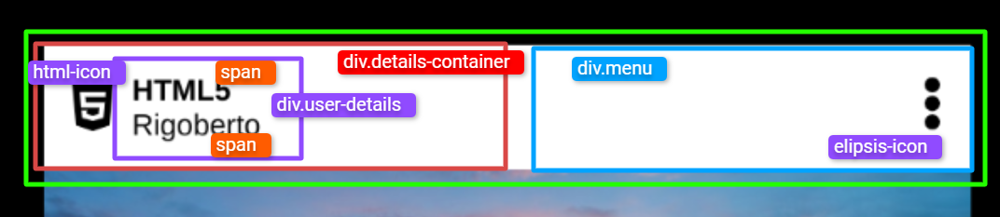

# `03` Create the post header

Build the header section of your Instagram post.



In this section, you should use flexbox to align the avatar and username to the left and the post options to the right. Make sure everything is well aligned horizontally.

### Instructions 📝

### 1. Edit the HTML file
Inside the `<div class="header-card">`, add these two main elements:  

**a. `span.html-icon`:**
- Create a `<span>` with the class `html-icon`.  
- Inside this `<span>`, include: an `<i>` tag for the HTML5 icon (use the class `fa fa-html5`) and text that contains: `HTML5` and `Rigoberto`.  

**b. `span.menu`:**
- Create another `<span>` with the class `menu`, inside this `<span>` add the menu icon using Font Awesome (use the icon `fa fa-ellipsis-v`).  
- **IMPORTANT**: Make sure the **Font Awesome** library is included in your HTML file. You can do this by adding this link in the `<head>` section:  

```html
<link rel="stylesheet" href="https://cdnjs.cloudflare.com/ajax/libs/font-awesome/4.7.0/css/font-awesome.min.css" />
```
       
## Style with CSS

Adjust the design to be clear, tidy, and attractive. Follow these suggestions:

### For `.header-card`:
- Use `display: flex` to organize the elements in a horizontal line.
- Apply `justify-content: space-between` to separate the elements towards the left and right ends.
- Add `align-items: center` to vertically align everything to the center.

### For `.html-icon`:
- Use `display: flex` so that the icon and text are in line.
- Add `gap: 8px` to create a small space between the icon and the text.
- Use `font-size: 24px` to make the icon more visible.

💡 **TIP:** If you find it difficult to position elements using flexbox, you might want to practice first with the following fun proposal [Flexbox Froggy](https://flexboxfroggy.com/).