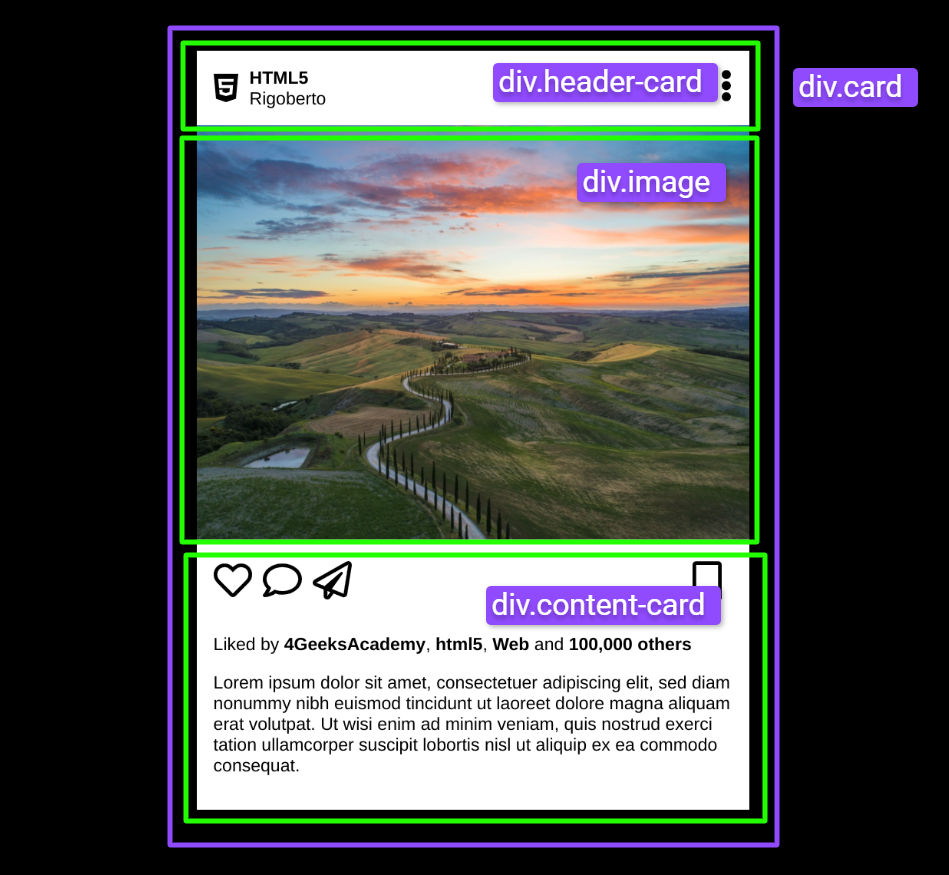

# `03` Create the main structure

Before writing a single line of code, it's essential to fully understand what you want to achieve. For example, if you're going to develop an interface card like the one in the image, you need to ask yourself questions such as:

- What elements will the card contain?  
- What are the main sections?

Breaking the project into smaller parts (such as header, image, content) helps approach the task in a more organized way.



### Instructions:

In this step, you will create the structure of the Instagram post using `div` tags to organize the sections.

- Create a `div.card` container that will have three sections, as shown in the image:
  - **Header (`div.header-card`)**: This will include the user’s avatar, their name, and a menu of options.
  - **Image (`div.image`)**: Where the post’s main image will be displayed.
  - **Body (`div.content-card`)**: This will contain interaction icons and the post description.


### Example

```html
<div class="card">
  <div class="header-card"></div>
  <div class="image"></div>
  <div class="content-card"></div>
</div>
```