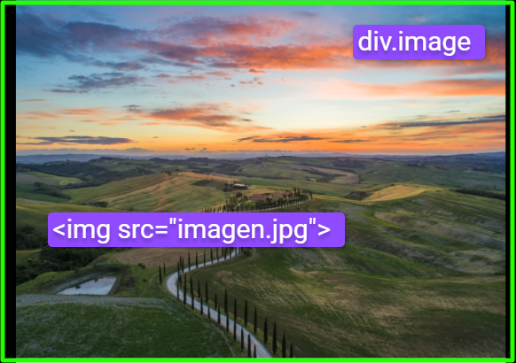

# `04` Agregar la imagen principal

En este paso, agregarás la imagen principal de tu post de Instagram. 

### Instrucciones

- **Agrega la etiqueta ``** para mostrar la imagen del post en el div contenedor para la imagen que añadiste en tu archivo `index.html` debajo del `div.header-card`.
- **Estiliza la imagen** con CSS para asegurarte de que se ajuste correctamente al diseño del post.