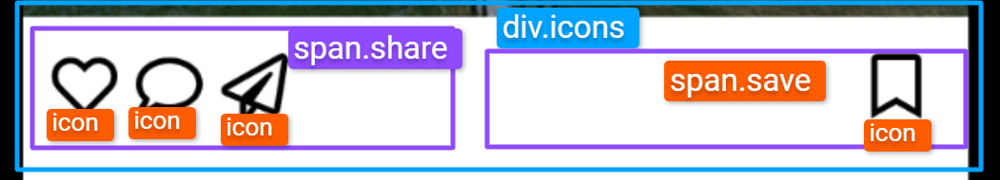

# `05` Posicionamiento de la sección de iconos de interacción

En este paso, organizarás los íconos de interacción en el cuerpo del post, como los botones de "me gusta", "comentar", "enviar" y "guardar".

### Instrucciones

- **Organiza el posicionamiento de los íconos** dentro del del `div.content-card`, crea un `div.icons` y dentro de este fijate de agrupar los iconos en dos elementos:
    - **`span.share`**: Contiene los iconos "me gusta", "comentar", "enviar".  
    - **`span.save`**: Contiene el icono "save".
- **Usa flexbox** para alinear los íconos de "me gusta", "comentar" y "enviar" a la izquierda, y el ícono de "guardar" a la derecha.
- **Estiliza la sección de íconos** con CSS para asegurar que estén bien alineados y espaciados, simulando la interfaz de Instagram.
