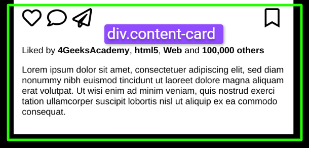

# `05` Positioning the Interaction Icons Section

In this step, you will organize the interaction icons in the body of the post, such as the "like", "comment", "send", and "save" buttons.



## 📝 Instructions

1. **Organize the icons in the HTML**: Inside the `<div class="content-card">`, we will create a `<div class="icons">`. Inside this div, we will group the "like", "comment", "send", and "save" icons.

2. Inside the `<div class="icons">`, we will create 2 `<span>`. The first one with a specific class, like `span.share`, which will contain the "like", "comment", and "send" icons.
3. For the second `<span>`, add the class `.save` and it will contain the "save" icon.

It should look like this:

```html
<div class="icons">
  <span class="share">
    <i class="fa fa-heart"></i>  <!-- Like icon -->
    <i class="fa fa-comment"></i>  <!-- Comment icon -->
    <i class="fa fa-paper-plane"></i>  <!-- Send icon -->
  </span>
  <span class="save">
    <i class="fa fa-bookmark"></i>  <!-- Save icon -->
  </span>
</div>
```

4. **Style with Flexbox in CSS**: Create a selector for the `.icons` class, apply `display: flex` and `justify-content: space-between` to organize the `.share` and `.save` containers. Make sure to adjust the size of the icons, for example, with `font-size: 24px`.

5. **Style the icons section**: For the icons section inside `.share`, make sure they have uniform spacing between them. Use the `gap` property to achieve this.

6. Create a selector for `content-card` and apply the `padding` property.