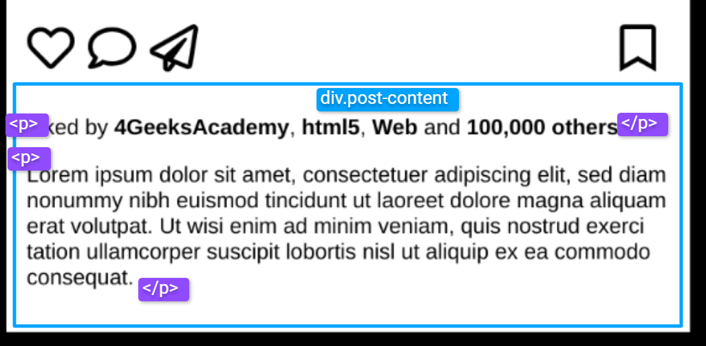

# `06` Añadir la sección de likes y la descripción del post

En este paso, añadirás la sección que muestra la cantidad de likes y una breve descripción del post.



## Instrucciones 📝

- **Agrega un `div.post-content`** justo debajo del cierre del `div.icons`. 
- **Agrega una etiqueta `<p>`** dentro del `div.post-content` para mostrar el texto de los likes. Puedes utilizar este texto de ejemplo: 

```html
<p>
    Liked by <strong>4GeeksAcademy</strong>, 
    <strong>html5</strong>, 
    <strong>Web</strong> and 
    <strong>100.000 others</strong>
</p>
```
- **Agrega una segunda etiqueta `<p>`** para la descripción del post. Usa un párrafo de ejemplo como "Lorem ipsum dolor sit amet...".
- **Estiliza ambas secciones con CSS:**
    - Tipografía: Usa una fuente legible y un tamaño adecuado para el texto.
    - Separación: Asegúrate de que haya espacio suficiente entre los likes y la descripción para mejorar la legibilidad.